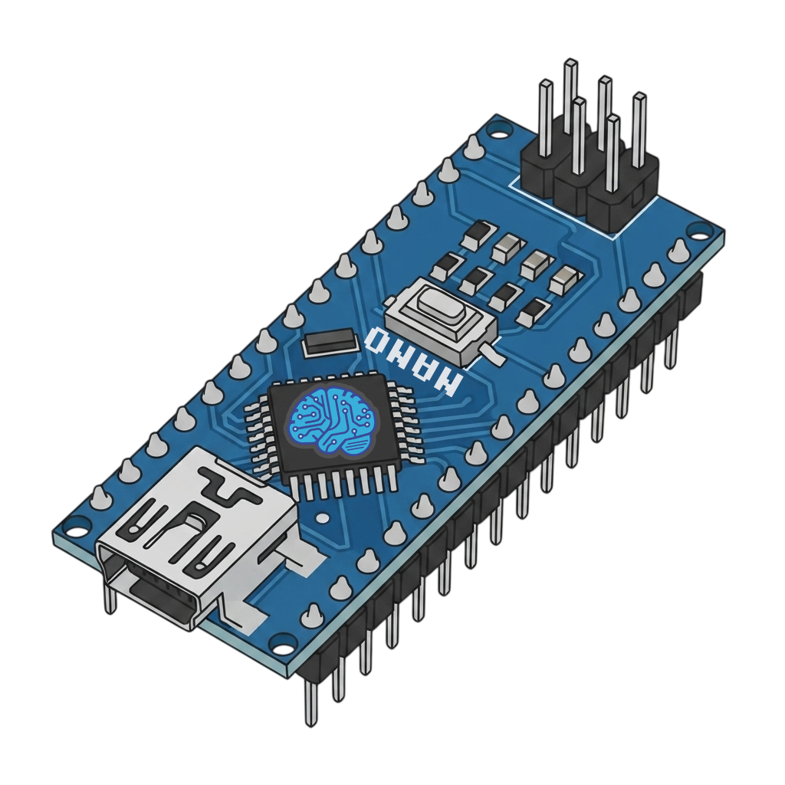

<div align="center">
  
  <h1>ASL Alphabet Recognition : MediaPipe → Arduino Nano</h1>

  <h4>
    Real-time sign language alphabet recognition using a webcam for
  hand landmark extraction and an Arduino Nano (ATmega328P) for
  layer-streaming MLP inference.
  </h4>
</div>

## Hardware

```
Arduino Nano          SSD1306 OLED (I2C)
  A4 (SDA) ─────────── SDA
  A5 (SCL) ─────────── SCL
  5V       ─────────── VCC
  GND      ─────────── GND
```

## Setup

```bash
py -3.12 -m venv .venv
.\.venv\Scripts\activate
pip install -r requirements.txt
```

Install Arduino CLI (one-time):

```powershell
Invoke-WebRequest -Uri "https://downloads.arduino.cc/arduino-cli/arduino-cli_latest_Windows_64bit.zip" -OutFile "$env:TEMP\arduino-cli.zip"
Expand-Archive -Path "$env:TEMP\arduino-cli.zip" -DestinationPath "$env:USERPROFILE\bin" -Force
arduino-cli core install arduino:avr
arduino-cli lib install "Adafruit SSD1306" "Adafruit GFX Library"
```

## Pipeline

| Step | Command                                                                                       | Description                              |
| ---- | --------------------------------------------------------------------------------------------- | ---------------------------------------- |
| 1    | `python collect_data.py`                                                                      | Collect landmarks (A–E, SPACE to record) |
| 2    | `python train.py --epochs 100`                                                                | Train MLP, saves `model.pt`              |
| 3a   | `python export_float.py`                                                                      | Export float32 → `model_float.h`         |
| 3b   | `python export.py`                                                                            | Export int16 → `model.h`                 |
| 3c   | `python export_int8.py`                                                                       | Export int8 → `model_int8.h`             |
| 4    | `arduino-cli compile --fqbn arduino:avr:nano:cpu=atmega328 firmware/sign_language_nano_float` | Compile float firmware                   |
| 5    | Flash via Arduino IDE or `arduino-cli upload`                                                 |                                          |
| 6    | `python stream.py --variant float`                                                            | Send landmarks over serial               |

## Quantization Variants

| Variant | Model Size | Inference | Flash | SRAM | Free RAM | Accuracy |
| ------- | ---------- | --------- | ----- | ---- | -------- | -------- |
| Float32 | 7,956 B    | 49.25 ms  | 88%   | 59%  | 826 B    | 89.58%   |
| INT16   | 4,296 B    | 10.70 ms  | 77%   | 53%  | 950 B    | 89.58%   |
| INT8    | 2,360 B    | 10.26 ms  | 71%   | 54%  | 930 B    | 88.45%   |

## Serial Protocol

Packet format: `<v1,v2,...,v42,CS>`

- 42 comma-separated int16 values (0–1000)
- CS = checksum (sum of 42 values mod 100)
- Baud rate: 115200

Response: `{sign,infer_us,confidence,fps,free_ram}\n`

## Collector Controls

| Key   | Action                              |
| ----- | ----------------------------------- |
| A–E   | Select label                        |
| SPACE | Start/stop recording                |
| O     | Toggle sample count overlay         |
| Q     | Quit (writes train/val/test splits) |

Flags: `--target 2000` (samples/class), `--rate 7` (samples/sec),
`--conf 0.7` (min confidence), `--sim` (headless test).

## Architecture

```
42 inputs → 32 ReLU → 16 ReLU → 5 Softmax
```

95 neurons, 1,989 parameters (1,936 weights + 53 biases).
INT32 accumulation prevents overflow across all variants.

## File Structure

```
features.py              Normalize landmarks → 42 int16
collect_data.py          Interactive data collector
train.py                 PyTorch MLP training
export.py                int16 quantize → model.h
export_int8.py           int8 quantize → model_int8.h
export_float.py          float32 → model_float.h
evaluate.py              Classification metrics
stream.py                Realtime serial sender (--variant float|int16|int8)
firmware/
  sign_language_nano/          INT16 Arduino firmware
  sign_language_nano_int8/     INT8 Arduino firmware
  sign_language_nano_float/    Float32 Arduino firmware
models/
  hand_landmarker.task         MediaPipe hand model
dataset/
  raw/                         Per-class raw CSVs
  train.csv, val.csv, test.csv
output/                        Measured datasets (A–J) + manuscript figures
  dataset_b_ablation.csv       Streaming vs conventional ablation
  dataset_c_scaling.csv        5 topologies, 5-seed mean±SD
  dataset_c_multiseed.csv      25 raw training runs
  dataset_d_timing*.csv        Per-layer timing probes (7 variants)
  dataset_e_memory.csv         Flash/SRAM per variant
  dataset_f_*.csv              Confusion matrices + raw predictions
  dataset_g_confidence.csv     Confidence scores per variant
  dataset_h_hidden_activations.csv  48-dim hidden activations
  dataset_i_latency.csv        Full pipeline latency breakdown
  dataset_j_pareto.csv         Accuracy/latency/memory Pareto table
  timing_probe_raw*.csv        Raw serial timing logs
  stream_log*.csv              Stream logs (float/int16/int8)
  figures/
    fig2_streaming_diagram.png … fig11_memory_map.png
experiments/                   Timing probes, checkpoints, generators
  firmware/                    Per-variant timing + conventional sketches
  models/                      30 training checkpoints (5 seeds × 5 archs)
  scripts/                     Figure/data/docx generator scripts
docs/
  architecture.md             MLP design, quantization, memory
  collector.md                Data collection workflow
  hardware.md                 Wiring, OLED layout, Nano specs
  serial_protocol.md          Packet format, checksum, parsing
  training.md                 Train, export, compile, upload
Graphical_Abstract.pdf         6-panel graphical abstract (300 dpi + vector)
```

## License

This project is licensed under the [CC BY-NC 4.0 License](LICENSE).
